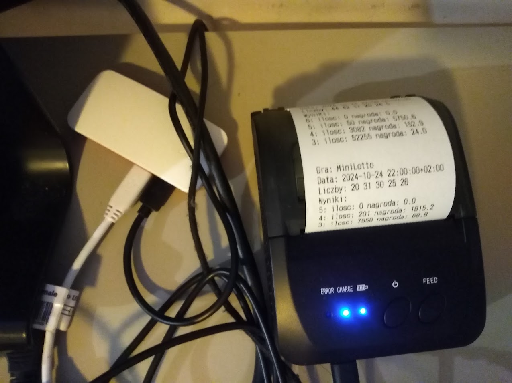

# totolottoprinter

Ten projekt to prosty bot, który regularnie pobiera wyniki losowań gier liczbowych i drukuje je na drukarce termicznej. Idealny do automatycznego drukowania wyników gier Lotto!
Bot jest przeznaczony do uruchamiania na Raspberry Pi, co czyni go idealnym rozwiązaniem do automatyzacji w domowym środowisku.

